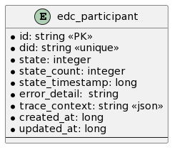

# SQL Participant store

Provides SQL persistence for participants

## Prerequisites

Please apply this [schema](docs/schema.sql) to your SQL database.

## Entity Diagram

## Configuration

| Key                             | Description                       | Mandatory | 
|:--------------------------------|:----------------------------------|-----------|
| edc.datasource.participant.name | Datasource used by this extension | X         |
